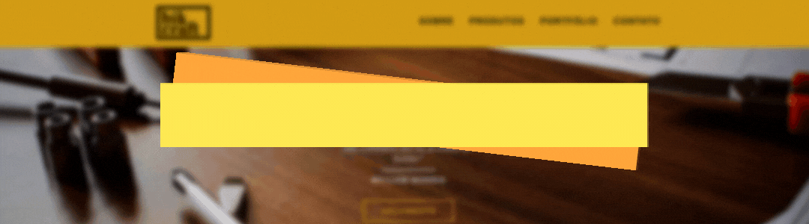
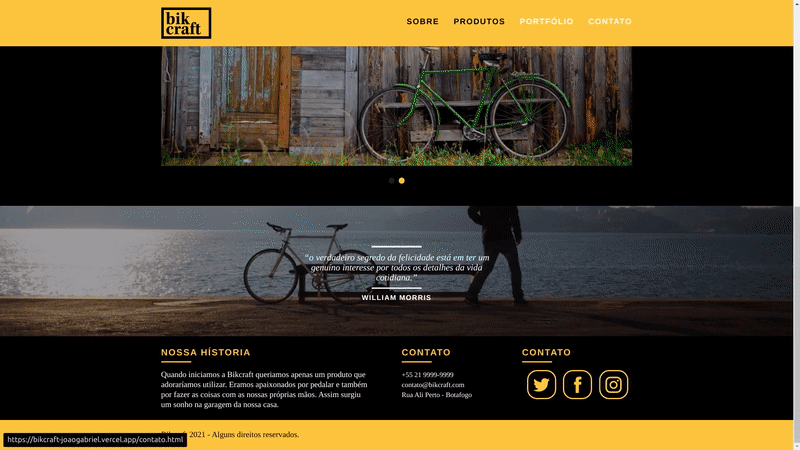

<!-- BANNER OU LOGO -->
<h1 align="center">
    
</h1>

<!-- TITULO E DESCRIÇAO -->
<div align="center">
	<h3>Bikcraft - Bicicletas Personalizadas</h3>
	<p align="center">Descrição do projeto, Lorem ipsum dolor sit amet, consectetur adipiscing elit, sed do eiusmod tempor incididunt ut labore et dolore magna aliqua. Ut enim ad minim veniam, quis nostrud exercitation ullamco laboris nisi ut aliquip ex ea commodo consequat. </p>
</div>

<!-- STATUS DO PROJETO -->
<h4 align="center"> 
	🚧 Concluido 🚧 
</h4>


<!-- TABELA DE CONTEUDOS -->
<!-- Inline -->
<!-- <p align="center">
 <a href="#objetivo">Objetivo</a> •
 <a href="#roadmap">Roadmap</a> • 
 <a href="#tecnologias">Tecnologias</a> • 
 <a href="#contribuicao">Contribuição</a> • 
 <a href="#licenc-a">Licença</a> • 
 <a href="#autor">Autor</a>
</p> -->

<!-- OU EM ARVORE -->
<!--ts-->
## 🗒️ Conteúdo
   * [Tabela de Conteudo](#-tabela-de-conteudo)
   * [Sobre](#-Sobre)
   * [Demonstração](#-Demonstração)
   * [Como usar](#-Pré-requisitos)
      * [Pre Requisitos](#-Pré-requisitos)
      * [Rodando aplicação](#-Rodando-a-aplicação)
   * [Tecnologias](#-Tecnologias-utilizadas)
   * [Autor](#-Autor)
<!--te-->


<!-- SOBRE -->
## 📖 Sobre
O projeto do Bikcraft foi desenvolvido no curso de Web Design Completo da plataforma de ensino Origamid. 
Nesse curso foi aprendido diversas tecnologias, desde conceitos basicos de UI/UX Design até a codificação do sistema, 
nele também foi possivel desenvolver tanto Wireframe como o seu Design completo, além, é claro do seu código. 
Bikcraft é uma empresa ficticia de vendas customizadas de bicicletas, nessa jornada foi aprendido conceitos sobre 
HTML semântico, SEO, organização de arquivos CSS, Javascript e varias outras tecnologias... 


<!-- DEMONSTRAÇÃO DA APLICAÇÃO -->
<!-- Colocar gifs e links da hospedagem -->
## 📺 Demonstração
Utilizando a ferramenta do AdobeXD, foi desenvolvido tanto o seu wireframe quanto o seu design, segue abaixo os links para o seu acesso:
- **[Wireframe do projeto](https://xd.adobe.com/view/95e96e6a-d057-42e1-a34f-bc99d2963f42-c0ba/?fullscreen&hints=off)**
- **[Design do projeto](https://xd.adobe.com/view/49a2fc68-e3ac-4e9c-b825-0217fcc8c506-1cf1/?fullscreen&hints=off)**
- **[Aplicação no ar](https://bikcraft-joaogabriel.vercel.app)**

<p align="center">
  
  
  
  
  
</p>


<!-- TECNOLOGIAS UTILIZADAS -->
## 🛠 Tecnologias utilizadas
As seguintes ferramentas foram usadas na construção do projeto:

- [HTML5](https://developer.mozilla.org/pt-BR/docs/Web/HTML)
- [CSS3](https://developer.mozilla.org/pt-BR/docs/Web/CSS)
- [JavaScript](https://developer.mozilla.org/pt-BR/docs/Web/JavaScript) 
  - [SimpleSlide](https://github.com/origamid/simple-slide)
  - [SimpleAnime](https://github.com/origamid/simple-anime)
  - [SimpleForm](https://github.com/origamid/simple-form)


<!-- PRE-REQUISITOS -->
## ⚠️ Pré-requisitos
Antes de começar, você vai precisar ter instalado em sua máquina as seguintes ferramentas:
- [Git](https://git-scm.com)
- [VSCode](https://code.visualstudio.com/)
- [LiveServer](https://marketplace.visualstudio.com/items?itemName=ritwickdey.LiveServer).


<!-- RODANDO A APLICAÇÃO -->
## 🔥 Rodando a aplicação
```bash
# Clone o repositório
git clone https://github.com/joaogabrieldev/Bikcraft

# Entre no diretório
cd bikcraft
```
Utilize o [Live Server](https://marketplace.visualstudio.com/items?itemName=ritwickdey.LiveServer) para criar um servidor local e executar o Bikcraft.


<!-- AUTOR -->
## 🤓 Autor
<div align="center" >
<a href="https://www.linkedin.com/in/joaogabrieldev/">
 
 <br />
 <b>João Gabriel</b></a> <a href="https://www.linkedin.com/in/joaogabrieldev/" title="Linkedin">🚀
</a>

Feito com ❤️ por João Gabriel 👋🏽 Entre em contato!

 [](https://www.instagram.com/joaogabriel.fn/) [](https://www.linkedin.com/in/joaogabrieldev/) [](mailto:dev.joaogabriel@gmail.com) [](https://t.me/joaogabrielfn)
	
</div>


